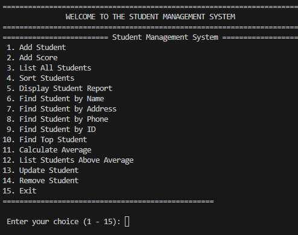

# 🏫 Student Management System

A Python program to manage student information, scores, and reports. Simple, interactive, and perfect for learning file handling and data management.  

---

## 📂 Features

- ✅ Add new students (name, age, address, email, phone, subjects, optional notes)  
- ✅ Add scores for each student by subject  
- ✅ List all students with basic info and average score  
- ✅ Sort students by name, age, or average score  
- ✅ Search students by name, address, phone, or ID  
- ✅ Display detailed student report (subjects, scores, notes, average)  
- ✅ Find top student and students above a certain average  
- ✅ Update student information with validation  
- ✅ Remove a student from the database  
- ✅ Data is saved in a JSON file 💾  

---

## 🖼️ Screenshot



---

## 💻 How to Run

1. Clone this repository, go into the folder, and run the program:

```bash
git clone https://github.com/Noemi-Condemi/student-management-system.git
cd student-management-system
python Student_Management_System.py
```

---

## 📝 Notes

- Make sure you have **Python 3.x** installed.  
- The program uses a **JSON file** to store data, so you don’t need a database setup.  
- Designed for learning and small-scale management—perfect for practice projects.
